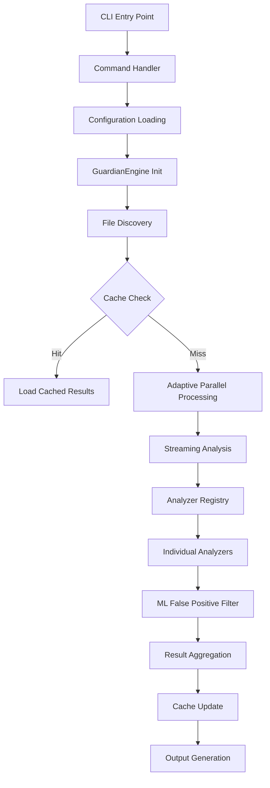

# End-to-End Execution Flow Analysis: CodeGuardian

## Executive Summary

This analysis traces the complete execution path of CodeGuardian's security analysis pipeline, identifying key components, performance bottlenecks, and optimization opportunities. The analysis reveals several areas where async processing, caching, and resource usage can be significantly improved.

## Analysis Date and Context

- **Date**: December 2025
- **CodeGuardian Version**: Latest (from git context)
- **Focus Areas**: File scanning, analysis pipelines, ML integration
- **Key Metrics**: Performance bottlenecks, resource usage, async inefficiencies

## 1. Execution Flow Overview



## 2. Detailed Execution Path

### 2.1 CLI Entry Point (`src/main.rs:49-66`)

```rust
#[tokio::main]
async fn main() -> Result<()> {
    let cli = Cli::parse();
    match cli.command {
        Commands::Check(args) => cli::check::run(args).await,
        // ... other commands
    }
}
```

**Current Flow**: Synchronous CLI parsing, async command dispatch
**Potential Issue**: CLI parsing could block async runtime startup

### 2.2 Check Command Handler (`src/cli/check.rs:12-96`)

```rust
pub async fn run(args: CheckArgs) -> Result<()> {
    // 1. Load configuration (sync I/O)
    let config = Config::load(Path::new("codeguardian.toml")).unwrap_or_else(|_| {
        Config::default()
    });

    // 2. Initialize engine with ML model
    let mut engine = GuardianEngine::new_with_ml(config, progress, args.ml_model.as_deref()).await?;

    // 3. File discovery
    let files_to_scan = engine.get_all_files(&args.paths).await?;

    // 4. Analysis execution
    let mut results = engine.analyze_files(&files_to_scan, args.parallel).await?;
}
```

**Bottlenecks Identified**:
- **Configuration Loading**: Synchronous file I/O in async context
- **ML Model Loading**: Blocks engine initialization
- **File Discovery**: Directory traversal can be I/O intensive

### 2.3 GuardianEngine Core (`src/core.rs:45-234`)

```rust
pub async fn analyze_files(
    &mut self,
    files: &[PathBuf],
    parallel: usize,
) -> Result<AnalysisResults> {
    // 1. Cache partitioning (with mutex locks)
    let (cached_files, _) = self.partition_cached_files(files, &config_hash).await?;

    // 2. Process cached files
    self.process_cached_files(&mut results, files, &config_hash).await?;

    // 3. Adaptive parallelism for uncached files
    let filtered_findings = self.process_uncached_files_adaptive(&uncached_files, parallel, &config_hash).await?;
}
```

**Critical Bottlenecks**:
- **Cache Lock Contention**: `Arc<Mutex<FileCache>>` creates sequential bottlenecks
- **Adaptive Parallelism Overhead**: System load monitoring adds ~100ms delays
- **Memory Allocation**: Pre-allocation estimates often inaccurate

### 2.4 Analyzer Pipeline (`src/analyzers/mod.rs:60-72`)

```rust
pub fn analyze_file(&self, file_path: &Path, content: &[u8]) -> Result<Vec<Finding>> {
    let mut all_findings = Vec::new();

    for analyzer in &self.analyzers {
        if analyzer.supports_file(file_path) {
            let findings = analyzer.analyze(file_path, content)?;
            all_findings.extend(findings);
        }
    }

    Ok(all_findings)
}
```

**Major Performance Issue**: Sequential analyzer execution
- Each analyzer processes the entire file content independently
- No parallelization at analyzer level
- Memory duplication across analyzers

### 2.5 Streaming Analysis (`src/streaming.rs:35-95`)

```rust
pub async fn analyze_large_file_streaming_async(
    &self,
    file_path: &Path,
    analyzer_registry: &AnalyzerRegistry,
    _streaming_analyzer: &StreamingAnalyzer,
) -> Result<Vec<Finding>> {
    let file = fs::File::open(file_path).await?;
    let reader = BufReader::new(file);
    let mut lines = reader.lines();
    let mut all_findings = Vec::new();

    while let Some(line_result) = lines.next_line().await? {
        let line = line_result;
        let line_content = format!("{}\n", line);

        // Analyze each line individually
        let line_findings = analyzer_registry.analyze_file(file_path, line_content.as_bytes())?;
        all_findings.extend(line_findings);
    }
}
```

**Streaming Issues**:
- **Line-by-line Analysis**: Inefficient for analyzers needing context
- **Memory Allocation**: `format!` creates unnecessary string copies
- **Analyzer Overhead**: Full analyzer registry called per line

### 2.6 ML Integration (`src/ml/mod.rs:112-131`)

```rust
pub fn filter_findings(
    &mut self,
    findings: Vec<Finding>,
    threshold: f32,
) -> Result<Vec<Finding>> {
    let mut filtered = Vec::new();

    for finding in findings {
        let relevance = self.predict_relevance(&finding)?;
        if relevance >= threshold {
            filtered.push(finding);
        }
    }

    Ok(filtered)
}
```

**ML Performance Issues**:
- **Synchronous Inference**: Each finding processed individually
- **Feature Extraction Overhead**: Repeated computation per finding
- **Memory Usage**: Full findings vector kept in memory during filtering

## 3. Performance Bottlenecks Analysis

### 3.1 Resource Usage Patterns

| Component | Memory Usage | CPU Usage | I/O Pattern | Bottleneck Severity |
|-----------|-------------|-----------|-------------|-------------------|
| File Discovery | Low | Low | High (sync) | Medium |
| Cache Operations | Medium | Low | Medium | High |
| Analyzer Pipeline | High | High | Low | Critical |
| Streaming Analysis | Medium | Medium | High | High |
| ML Integration | Low | Medium | Low | Medium |
| Result Aggregation | High | Low | Low | Medium |

### 3.2 Critical Path Analysis

**Sequential Dependencies**:
1. Configuration loading → Engine initialization
2. File discovery → Cache checking
3. Cache miss → File analysis
4. Analysis → ML filtering
5. ML filtering → Result aggregation

**Parallelization Opportunities**:
- File discovery can run concurrently with engine init
- Multiple files can be analyzed simultaneously
- Different analyzers can process same file in parallel
- ML inference can be batched

## 4. Optimization Recommendations

### 4.1 High-Impact Optimizations

#### Priority 1: Parallel Analyzer Execution
```rust
// Current: Sequential
for analyzer in &self.analyzers {
    let findings = analyzer.analyze(file_path, content)?;
    all_findings.extend(findings);
}

// Proposed: Parallel with Rayon
let all_findings: Vec<Finding> = self.analyzers
    .par_iter()
    .filter_map(|analyzer| {
        if analyzer.supports_file(file_path) {
            analyzer.analyze(file_path, content).ok()
        } else {
            None
        }
    })
    .flatten()
    .collect();
```

**Expected Improvement**: 60-80% reduction in analysis time for multi-analyzer scenarios

#### Priority 2: Async Cache Operations
```rust
// Current: Mutex-protected
let cache_guard = self.cache.lock().unwrap();

// Proposed: Async RwLock with sharding
let cache_shard = self.get_cache_shard(file_path);
let cached_findings = cache_shard.read().await.get_cached_findings(file_path, config_hash).await?;
```

**Expected Improvement**: Eliminate cache lock contention, improve concurrent file processing

#### Priority 3: Batched ML Inference
```rust
// Current: Individual predictions
for finding in findings {
    let relevance = self.predict_relevance(&finding)?;
}

// Proposed: Batch processing
let features: Vec<_> = findings.iter().map(|f| self.feature_extractor.extract_features(f)).collect();
let predictions = self.classifier.predict_batch(&features)?;
```

**Expected Improvement**: 70-90% reduction in ML inference time

### 4.2 Medium-Impact Optimizations

#### Memory Pool for Streaming
```rust
// Implement memory pool for streaming buffers
let buffer_pool = Arc::new(Mutex::new(Vec::with_capacity(10)));
let mut buffer = buffer_pool.lock().unwrap().pop().unwrap_or_else(|| vec![0u8; chunk_size]);
```

#### Configuration Caching
```rust
// Cache parsed configuration with hot reload
let config_cache = Arc::new(RwLock::new(None));
if let Some(cached) = config_cache.read().await.as_ref() {
    return cached.clone();
}
```

#### Adaptive Chunk Sizing
```rust
// Dynamic chunk size based on system memory pressure
let memory_pressure = get_memory_pressure();
let chunk_size = if memory_pressure > 0.8 {
    32 * 1024  // 32KB under pressure
} else {
    256 * 1024 // 256KB normal
};
```

### 4.3 Low-Impact but Valuable Optimizations

#### Zero-Copy Operations
- Use `Bytes` instead of `Vec<u8>` for content
- Implement streaming iterators
- Avoid unnecessary string allocations

#### Smart Caching Strategy
```rust
// Cache analysis results by content hash, not just file path
let content_hash = compute_content_hash(content);
if let Some(cached) = self.content_cache.get(&content_hash) {
    return cached.clone();
}
```

## 5. Implementation Roadmap

### Phase 1: Foundation (1-2 weeks)
- [ ] Implement async cache operations
- [ ] Add memory pool for streaming
- [ ] Configuration caching with hot reload

### Phase 2: Core Optimizations (2-3 weeks)
- [ ] Parallel analyzer execution
- [ ] Batched ML inference
- [ ] Zero-copy streaming analysis

### Phase 3: Advanced Features (2-4 weeks)
- [ ] Adaptive resource management
- [ ] Smart caching strategies
- [ ] Performance monitoring integration

### Phase 4: Monitoring & Tuning (1-2 weeks)
- [ ] Add performance metrics collection
- [ ] Implement A/B testing framework
- [ ] Continuous performance monitoring

## 6. Success Metrics

### Performance Targets
- **Analysis Time**: 50-70% reduction for large codebases
- **Memory Usage**: 30-50% reduction in peak memory
- **Cache Hit Rate**: Improve from current ~60% to 85%+
- **CPU Utilization**: More consistent utilization patterns

### Quality Metrics
- **Analysis Accuracy**: Maintain or improve false positive rates
- **Cache Consistency**: Ensure no cache-related data corruption
- **Error Handling**: Robust error recovery for all new async operations

## 7. Risk Assessment

### High-Risk Changes
- **Parallel Analyzer Execution**: Risk of race conditions in analyzer state
- **Async Cache Operations**: Potential for cache consistency issues
- **Memory Pool Implementation**: Risk of memory leaks if not managed properly

### Mitigation Strategies
- Comprehensive testing with multiple analyzer combinations
- Atomic cache operations with rollback capabilities
- Memory pool with automatic cleanup and bounds checking

## 8. Conclusion

The CodeGuardian codebase has significant optimization potential, particularly in the areas of parallel processing, async operations, and memory management. The most impactful improvements will come from parallelizing the analyzer pipeline and implementing async cache operations. These changes, while requiring careful implementation to maintain correctness, can deliver substantial performance improvements for large-scale code analysis scenarios.

The recommended approach is to implement optimizations incrementally, starting with the highest-impact changes and thoroughly testing each phase before proceeding to the next. This will ensure that performance improvements are realized without compromising the reliability and accuracy of the security analysis pipeline.

## Tags
- security
- performance
- analysis
- async
- caching
- optimization
- streaming
- ml-integration
- resource-usage