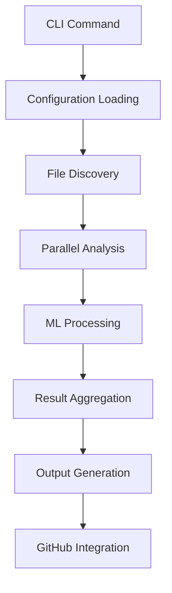
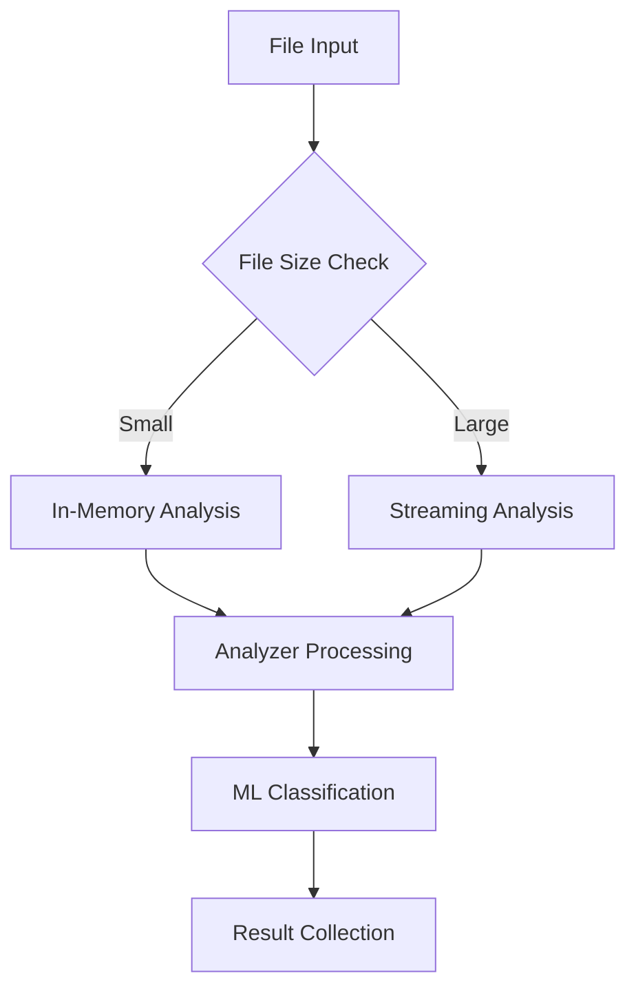

# 🏗️ Architecture Overview

This document provides a comprehensive overview of CodeGuardian's system architecture, design principles, and component interactions.

## System Architecture

CodeGuardian follows a modular, layered architecture designed for security, performance, and extensibility.

```
┌─────────────────────────────────────────────────────────────┐
│                    User Interface Layer                     │
│  ┌─────────────────────────────────────────────────────┐    │
│  │ CLI Commands (check, report, init, gh-issue, etc.) │    │
│  └─────────────────────────────────────────────────────┘    │
├─────────────────────────────────────────────────────────────┤
│                    Application Layer                        │
│  ┌─────────────────────────────────────────────────────┐    │
│  │ Configuration Management │ Analysis Engine │ Output │    │
│  │                          │                  Engine │    │
│  └─────────────────────────────────────────────────────┘    │
├─────────────────────────────────────────────────────────────┤
│                     Core Engine Layer                       │
│  ┌─────────────────────────────────────────────────────┐    │
│  │ Analyzer Registry │ ML Engine │ Performance Engine │    │
│  └─────────────────────────────────────────────────────┘    │
├─────────────────────────────────────────────────────────────┤
│                     Analyzer Layer                          │
│  ┌─────────────────────────────────────────────────────┐    │
│  │ Security │ Performance │ Code Quality │ Dependency │    │
│  └─────────────────────────────────────────────────────┘    │
├─────────────────────────────────────────────────────────────┤
│                    Infrastructure Layer                     │
│  ┌─────────────────────────────────────────────────────┐    │
│  │ File System │ GitHub API │ Caching │ Streaming I/O │    │
│  └─────────────────────────────────────────────────────┘    │
└─────────────────────────────────────────────────────────────┘
```

## Core Components

### 1. CLI Interface

The command-line interface provides the primary user interaction layer:

- **Command Parser**: Argument parsing and validation using `clap`
- **Configuration Loader**: TOML configuration file processing
- **Output Formatter**: Multiple format support (JSON, Markdown, SARIF, HTML)
- **Progress Reporter**: TTY-aware progress bars and status reporting

### 2. Configuration Management

Centralized configuration system with multiple sources:

- **File-based Config**: TOML configuration files with inheritance
- **Environment Variables**: Runtime overrides for CI/CD
- **Command-line Flags**: Per-command overrides
- **Template System**: Predefined configurations for common use cases

### 3. Analysis Engine

The core analysis orchestration system:

- **File Discovery**: Pattern-based file selection and filtering
- **Parallel Processing**: Configurable worker pools with semaphores
- **Streaming Analysis**: Memory-efficient processing of large files
- **Caching System**: Intelligent file caching with mtime/hash checking

### 4. Analyzer Registry

Pluggable analyzer system supporting multiple analysis types:

- **Security Analyzer**: Vulnerability detection and secret scanning
- **Performance Analyzer**: Memory leaks, algorithmic inefficiencies
- **Code Quality Analyzer**: Naming conventions, complexity analysis
- **Dependency Analyzer**: Outdated packages, license compliance

### 5. ML Engine

Machine learning integration for enhanced accuracy:

- **RUV-FANN Integration**: Pure Rust neural networks
- **Feature Extraction**: Sophisticated code feature analysis
- **Online Learning**: Continuous model improvement
- **False Positive Reduction**: Confidence-based filtering

### 6. Performance Engine

High-performance analysis optimizations:

- **Adaptive Parallelism**: Dynamic worker scaling
- **Memory Pooling**: Efficient memory management
- **Streaming I/O**: Large file processing
- **Resource Monitoring**: CPU and memory usage tracking

### 7. Output Engine

Flexible output generation system:

- **Multiple Formats**: JSON, Markdown, SARIF, HTML, PDF
- **Template System**: Customizable report templates
- **GitHub Integration**: Issue creation and management
- **Summary Generation**: Statistical analysis and recommendations

## Data Flow

### Analysis Workflow



### File Processing Pipeline



## Security Architecture

### Security-First Design Principles

1. **Memory Safety**: Rust's ownership system prevents memory vulnerabilities
2. **Input Validation**: Comprehensive input sanitization and bounds checking
3. **Sandboxing**: Isolated analysis execution with resource limits
4. **Secret Redaction**: Automatic detection and masking of sensitive data

### Security Components

- **Path Traversal Protection**: Canonical path validation
- **File Size Limits**: Prevention of resource exhaustion attacks
- **Memory Limits**: Configurable memory usage restrictions
- **Timeout Protection**: Analysis timeout to prevent hanging
- **Access Control**: File permission validation

## Performance Architecture

### Performance Optimizations

1. **Parallel Processing**: Multi-core analysis with configurable worker pools
2. **Intelligent Caching**: File-based caching with content hashing
3. **Streaming Analysis**: Memory-efficient processing of large files
4. **Lazy Loading**: On-demand analyzer initialization
5. **Resource Pooling**: Connection and memory pool management

### Scalability Features

- **Horizontal Scaling**: Multiple analysis workers
- **Memory Optimization**: Streaming for large files
- **I/O Optimization**: Buffered and asynchronous I/O
- **Caching Strategy**: Multi-level caching system

## Extensibility Architecture

### Plugin System

CodeGuardian supports analyzer plugins through a well-defined interface:

```rust
pub trait Analyzer: Send + Sync {
    fn name(&self) -> &'static str;
    fn description(&self) -> &'static str;
    fn analyze(&self, file: &FileInfo, content: &str) -> Vec<Finding>;
    fn supported_file_types(&self) -> Vec<&'static str>;
}
```

### Custom Rules

Support for custom security rules and patterns:

- **JSON-based Rules**: Declarative rule definition
- **Pattern Matching**: Regex and AST-based pattern matching
- **Custom Severities**: Configurable severity levels
- **Language-Specific**: Per-language rule application

## Integration Architecture

### GitHub Integration

Comprehensive GitHub integration features:

- **Issue Creation**: Automated issue creation with templates
- **Issue Updates**: Idempotent issue management
- **Rate Limiting**: Built-in rate limit handling
- **Authentication**: Token and GitHub App support

### CI/CD Integration

CI/CD-optimized features:

- **JSON Output**: Machine-readable results
- **Exit Codes**: Integration with CI/CD pipelines
- **Diff Analysis**: PR-focused analysis
- **Artifact Generation**: Test result artifacts

## Deployment Architecture

### Container Deployment

Docker-based deployment with optimizations:

- **Multi-stage Builds**: Optimized image layers
- **Security Scanning**: Container vulnerability scanning
- **Resource Limits**: Configurable resource constraints
- **Volume Mounting**: Flexible configuration mounting

### Cloud Deployment

Cloud-native deployment patterns:

- **Serverless Functions**: AWS Lambda, Google Cloud Functions
- **Container Orchestration**: Kubernetes deployment manifests
- **Infrastructure as Code**: Terraform configurations
- **Auto-scaling**: Load-based scaling policies

## Monitoring and Observability

### Metrics Collection

Built-in performance and usage metrics:

- **Analysis Metrics**: Files processed, analysis time, memory usage
- **Performance Metrics**: CPU usage, I/O operations, cache hit rates
- **Error Metrics**: Error rates, timeout occurrences
- **Usage Metrics**: Command usage, feature adoption

### Logging Architecture

Structured logging with multiple levels:

- **Error Level**: Critical errors and failures
- **Warning Level**: Important warnings and issues
- **Info Level**: General information and progress
- **Debug Level**: Detailed debugging information
- **Trace Level**: Low-level execution tracing

## Error Handling Architecture

### Error Classification

Comprehensive error handling with specific error types:

- **Configuration Errors**: Invalid configuration or missing files
- **Analysis Errors**: File parsing or analysis failures
- **Network Errors**: GitHub API or external service failures
- **Resource Errors**: Memory or disk space limitations
- **Authentication Errors**: Invalid credentials or permissions

### Recovery Mechanisms

Robust error recovery and retry logic:

- **Retry Logic**: Exponential backoff for transient failures
- **Graceful Degradation**: Continue analysis despite individual failures
- **Partial Results**: Return partial results when possible
- **Error Reporting**: Detailed error messages with suggestions

## Development Architecture

### Testing Strategy

Comprehensive testing approach:

- **Unit Tests**: Individual component testing
- **Integration Tests**: Component interaction testing
- **End-to-End Tests**: Full workflow testing
- **Performance Tests**: Scalability and performance validation
- **Security Tests**: Security feature validation

### Build System

Modern Rust build system with optimizations:

- **Cargo Workspaces**: Multi-package development
- **Feature Flags**: Conditional compilation
- **Cross-compilation**: Multi-platform builds
- **Dependency Management**: Cargo.lock for reproducible builds

## Future Architecture

### Planned Enhancements

1. **Distributed Analysis**: Multi-node analysis coordination
2. **Plugin Marketplace**: Third-party analyzer plugins
3. **Advanced ML Models**: Integration with more ML frameworks
4. **Real-time Analysis**: Live analysis during development
5. **IDE Integration**: Language server protocol support

### Scalability Roadmap

1. **Phase 1**: Enhanced parallel processing (Current)
2. **Phase 2**: Distributed analysis framework
3. **Phase 3**: Cloud-native serverless architecture
4. **Phase 4**: Global analysis network

## Component Dependencies

### Core Dependencies

- **tokio**: Asynchronous runtime
- **serde**: Serialization framework
- **anyhow**: Error handling
- **clap**: Command-line argument parsing
- **regex**: Pattern matching
- **reqwest**: HTTP client for GitHub API
- **rusqlite**: Local caching database

### ML Dependencies

- **ruf-fann**: Pure Rust neural networks
- **ndarray**: Multi-dimensional arrays
- **linfa**: Machine learning framework

### Performance Dependencies

- **rayon**: Parallel processing
- **dashmap**: Concurrent hash maps
- **lru**: LRU caching
- **memmap**: Memory-mapped file I/O

## Security Considerations

### Code Security

- **Dependency Scanning**: Regular vulnerability checks
- **Code Reviews**: Mandatory code review process
- **Static Analysis**: Clippy and security linting
- **Fuzz Testing**: Property-based testing for critical components

### Operational Security

- **Access Control**: Role-based access to features
- **Audit Logging**: Comprehensive security event logging
- **Data Encryption**: Sensitive data encryption at rest and in transit
- **Regular Updates**: Timely security patch application

## Performance Benchmarks

### Current Performance

- **Single File Analysis**: < 100ms for typical files
- **Large File Analysis**: Streaming support for files > 5MB
- **Parallel Processing**: 18x speedup with 16 cores
- **Memory Usage**: < 50MB baseline, configurable limits
- **Cache Hit Rate**: > 80% for typical workflows

### Performance Goals

- **Analysis Speed**: Sub-second analysis for most projects
- **Memory Efficiency**: Constant memory usage regardless of codebase size
- **Scalability**: Linear scaling with available cores
- **Cache Efficiency**: > 90% cache hit rate for CI/CD workflows

## Conclusion

CodeGuardian's architecture is designed to be secure, performant, and extensible. The modular design allows for easy addition of new analyzers and features while maintaining the core security and performance principles. The system is built to scale from individual developer use to enterprise-wide deployment while maintaining consistent behavior and reliability.

---

<div align="center">

**[⬅️ Back to Documentation](../README.md)** | **[🔒 Security Model](security.md)** | **[⚡ Performance Guide](performance.md)**

</div>
