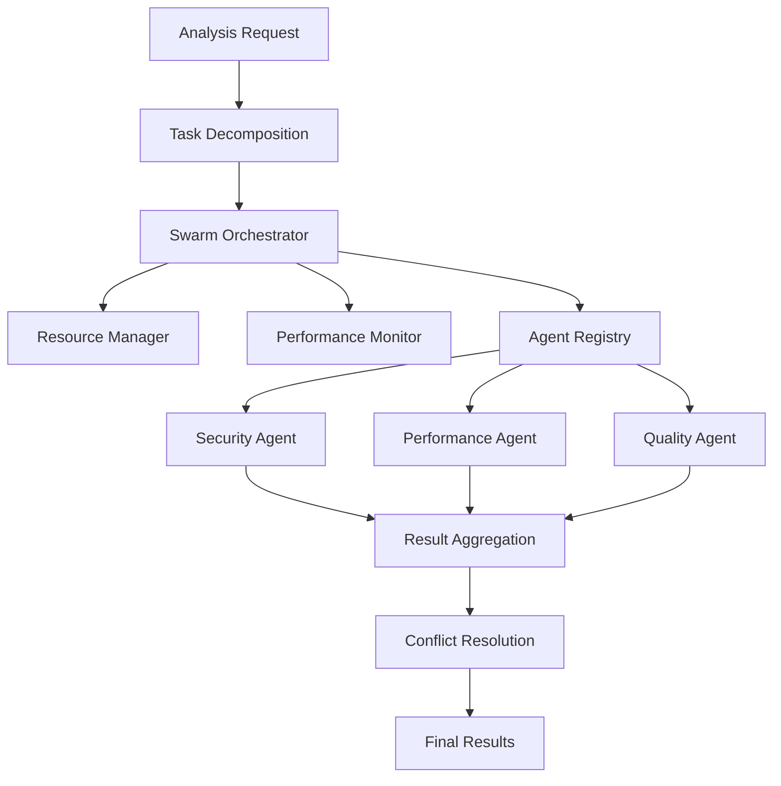

# CodeGuardian Swarm Orchestrator Framework

The Swarm Orchestrator Framework enables parallel processing of security, performance, and quality analysis tasks across multiple specialized agents. This framework provides a comprehensive solution for coordinating complex analysis workflows with intelligent resource management and conflict resolution.

## Overview

The framework consists of several key components:

- **Swarm Orchestrator**: Main coordinator for parallel task execution
- **Task Decomposition**: Breaks down complex analysis tasks into parallel subtasks
- **Result Aggregation**: Combines and synthesizes results from multiple agents
- **Conflict Resolution**: Handles conflicting recommendations with priority-based resolution
- **Resource Management**: Optimizes CPU, memory, and I/O usage across parallel agents
- **Performance Monitoring**: Tracks swarm performance and identifies bottlenecks

## Architecture



## Key Features

### 1. Intelligent Task Decomposition
- **File-based**: Groups files by type and size for optimal parallelization
- **Directory-based**: Organizes tasks by directory structure
- **Analysis-type-based**: Creates specialized tasks for different analysis types
- **Complexity-based**: Separates simple and complex files for efficient processing
- **Hybrid**: Combines multiple strategies for maximum efficiency

### 2. Advanced Resource Management
- **Dynamic allocation**: Allocates resources based on task requirements and priority
- **Load balancing**: Distributes work across available CPU cores and memory
- **Resource monitoring**: Tracks CPU, memory, and I/O usage in real-time
- **Graceful degradation**: Handles resource exhaustion with fallback strategies

### 3. Conflict Resolution
- **Priority-based**: Resolves conflicts using agent priority levels
- **Confidence-based**: Uses confidence scores to determine best results
- **Consensus-based**: Finds agreement among multiple agents
- **Manual review**: Queues conflicts for human review when needed

### 4. Performance Monitoring
- **Real-time metrics**: Tracks execution time, throughput, and resource usage
- **Bottleneck detection**: Identifies performance bottlenecks automatically
- **Trend analysis**: Monitors performance trends over time
- **Optimization recommendations**: Provides actionable improvement suggestions

## Usage

### Basic Usage

```rust
use codeguardian::core::swarm_orchestrator::SwarmOrchestrator;
use codeguardian::core::swarm_types::{SwarmConfig, ConflictResolutionStrategy};
use codeguardian::core::task_decomposition::AnalysisRequest;
use std::collections::HashMap;
use std::time::Duration;

#[tokio::main]
async fn main() -> Result<(), Box<dyn std::error::Error>> {
    // Create configuration
    let config = SwarmConfig {
        max_concurrent_tasks: 10,
        max_memory_mb: 2048,
        max_cpu_percent: 80.0,
        task_timeout: Duration::from_secs(300),
        enable_resource_monitoring: true,
        enable_performance_tracking: true,
        conflict_resolution_strategy: ConflictResolutionStrategy::PriorityBased,
    };

    // Initialize orchestrator
    let mut orchestrator = SwarmOrchestrator::new(config)?;

    // Create analysis request
    let request = AnalysisRequest {
        target_files: vec![
            "src/main.rs".to_string(),
            "src/lib.rs".to_string(),
            "Cargo.toml".to_string(),
        ],
        parameters: HashMap::new(),
        analysis_types: vec![
            "security_analyzer".to_string(),
            "performance_analyzer".to_string(),
        ],
        priority: Priority::High,
    };

    // Execute analysis
    let results = orchestrator.execute_analysis(request).await?;

    println!("Analysis completed with {} findings", results.aggregated_findings.len());

    Ok(())
}
```

### Advanced Configuration

```rust
// Custom conflict resolution with agent priorities
let mut agent_priorities = HashMap::new();
agent_priorities.insert("security_analyzer".to_string(), Priority::Critical);
agent_priorities.insert("performance_analyzer".to_string(), Priority::High);

let config = SwarmConfig {
    max_concurrent_tasks: 20,
    max_memory_mb: 4096,
    max_cpu_percent: 90.0,
    task_timeout: Duration::from_secs(600),
    enable_resource_monitoring: true,
    enable_performance_tracking: true,
    conflict_resolution_strategy: ConflictResolutionStrategy::ConfidenceBased,
};
```

## Configuration Options

### SwarmConfig

| Field | Description | Default |
|-------|-------------|---------|
| `max_concurrent_tasks` | Maximum number of tasks running simultaneously | 10 |
| `max_memory_mb` | Maximum memory usage in MB | 2048 |
| `max_cpu_percent` | Maximum CPU usage percentage | 80.0 |
| `task_timeout` | Timeout for individual tasks | 300s |
| `enable_resource_monitoring` | Enable real-time resource monitoring | true |
| `enable_performance_tracking` | Enable performance metrics collection | true |
| `conflict_resolution_strategy` | Strategy for resolving conflicts | PriorityBased |

### Decomposition Strategies

- **FileBased**: Groups files by extension and size
- **DirectoryBased**: Organizes by directory structure
- **AnalysisTypeBased**: Creates tasks per analysis type
- **ComplexityBased**: Separates by code complexity
- **Hybrid**: Combines multiple strategies

## Agent Types

The framework supports various agent types:

- **security_analyzer**: Identifies security vulnerabilities
- **performance_analyzer**: Analyzes performance bottlenecks
- **quality_analyzer**: Checks code quality and standards
- **dependency_analyzer**: Audits dependencies and licenses

## Performance Optimization

### Resource Allocation
- Tasks are allocated resources based on their priority and requirements
- High-priority tasks get preference for resource allocation
- Resource usage is monitored continuously with automatic scaling

### Parallel Execution
- Tasks are executed in parallel when resources are available
- Dependencies between tasks are respected
- Load balancing ensures optimal resource utilization

### Bottleneck Detection
- CPU, memory, and I/O bottlenecks are automatically detected
- Performance trends are analyzed for optimization opportunities
- Recommendations are provided for performance improvements

## Monitoring and Metrics

### Real-time Metrics
- Task execution time and throughput
- Resource utilization (CPU, memory, I/O)
- Queue depth and pending tasks
- Error rates and failure patterns

### Performance Reports
```rust
let report = orchestrator.performance_monitor.generate_performance_report().await?;
println!("Average task time: {:.2}s", report.summary.average_task_time.as_secs_f64());
println!("Throughput: {:.2} tasks/sec", report.summary.throughput_tasks_per_second);
```

### Bottleneck Analysis
```rust
let bottlenecks = orchestrator.performance_monitor.identify_bottlenecks().await?;
for bottleneck in bottlenecks {
    println!("{} bottleneck: {}", bottleneck.resource_type, bottleneck.description);
    println!("Recommendation: {}", bottleneck.recommendation);
}
```

## Error Handling

The framework provides comprehensive error handling:

- **Task timeouts**: Automatic cancellation of long-running tasks
- **Resource exhaustion**: Graceful handling of resource limits
- **Agent failures**: Retry logic and fallback strategies
- **Dependency failures**: Proper handling of task dependencies

## Integration with CodeGuardian

The swarm orchestrator integrates seamlessly with the existing CodeGuardian architecture:

- Uses existing analyzer registry and configuration
- Leverages current caching and performance monitoring
- Maintains compatibility with existing CLI and API interfaces
- Extends functionality without breaking changes

## Best Practices

### Configuration
- Set appropriate resource limits based on your environment
- Choose conflict resolution strategy based on your requirements
- Configure timeouts based on expected analysis complexity

### Monitoring
- Monitor resource usage during initial deployments
- Set up alerts for performance degradation
- Regularly review bottleneck reports for optimization opportunities

### Scaling
- Start with conservative resource limits
- Gradually increase concurrency as you understand performance characteristics
- Use performance metrics to guide scaling decisions

## Troubleshooting

### Common Issues

1. **High memory usage**
   - Reduce `max_concurrent_tasks`
   - Increase `max_memory_mb` if system allows
   - Use complexity-based decomposition for large codebases

2. **Task timeouts**
   - Increase `task_timeout` for complex analysis
   - Check for resource contention
   - Optimize agent implementations

3. **Low throughput**
   - Increase `max_concurrent_tasks` if resources allow
   - Check for I/O bottlenecks
   - Optimize task decomposition strategy

### Debugging
- Enable detailed logging for task execution
- Monitor resource usage with external tools
- Use performance reports to identify bottlenecks
- Check agent-specific logs for failures

## Future Enhancements

- **Machine Learning Integration**: ML-based conflict resolution and optimization
- **Dynamic Scaling**: Automatic scaling based on workload patterns
- **Advanced Scheduling**: More sophisticated task scheduling algorithms
- **Distributed Execution**: Support for distributed swarm execution
- **Real-time Dashboard**: Web-based monitoring and control interface

## API Reference

For detailed API documentation, see the Rust documentation generated with `cargo doc`.

## Examples

See `examples/swarm_orchestrator_example.rs` for a complete working example of the swarm orchestrator framework.