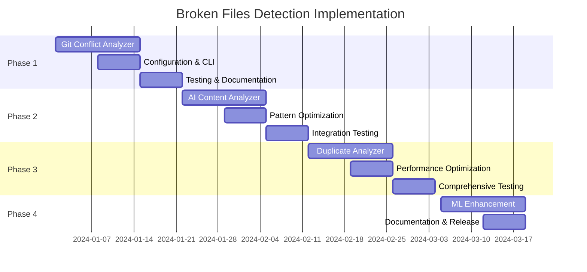

# Broken Files Detection Enhancement Plan

## Executive Summary

This document outlines the implementation plan for adding broken files detection capabilities to CodeGuardian. These enhancements will transform CodeGuardian from a security scanner into a comprehensive code integrity platform, addressing critical gaps in current code analysis tools.

**Status**: ✅ **APPROVED FOR IMPLEMENTATION**  
**Priority**: **HIGH**  
**Estimated Timeline**: 6-8 weeks  
**Strategic Value**: **CRITICAL**

## Problem Statement

Current security analysis tools miss critical code integrity issues that can compromise security and reliability:

1. **Git Merge Conflicts**: Unresolved conflicts create corrupted files that break builds and make security analysis unreliable
2. **AI-Generated Placeholders**: Incomplete AI-generated code may bypass security reviews and contain vulnerabilities
3. **Duplicate Security Code**: Copy-paste security implementations create multiple vulnerability points and maintenance risks

## Solution Overview

Implement three new analyzer modules that integrate seamlessly with CodeGuardian's existing architecture:

1. **Git Conflict Analyzer**: Detects unresolved merge conflicts and validates file integrity
2. **AI Content Analyzer**: Identifies AI-generated placeholder content and incomplete implementations
3. **Duplicate Code Analyzer**: Finds security-relevant code duplications that pose maintenance risks

## Architecture Integration

### Existing Strengths to Leverage

```rust
// Perfect foundation: Analyzer trait
pub trait Analyzer {
    fn name(&self) -> &str;
    fn analyze(&self, file_path: &Path, content: &[u8]) -> Result<Vec<Finding>>;
    fn supports_file(&self, file_path: &Path) -> bool;
}

// Robust finding system
pub struct Finding {
    pub analyzer: String,
    pub severity: Severity,
    pub file: PathBuf,
    pub line: u32,
    pub message: String,
    pub description: Option<String>,
    pub suggestion: Option<String>,
    // ... metadata support
}
```

### Integration Points

- **AnalyzerRegistry**: Add new analyzers to existing registry
- **Configuration**: Extend TOML config with new sections
- **CLI**: Add new command-line options
- **Git Module**: Enhance existing git operations
- **Reporting**: Leverage existing JSON/Markdown output

## Implementation Plan

### Phase 1: Git Conflict Detection (Week 1-2)

**Priority**: **CRITICAL** - Immediate value, zero risk

**Deliverables**:
- `src/analyzers/git_conflict_analyzer.rs`
- Configuration options in `codeguardian.toml`
- CLI integration (`--detect-conflicts`, `--fail-on-conflicts`)
- Unit tests and documentation

**Implementation Details**:
```rust
pub struct GitConflictAnalyzer {
    conflict_markers: Vec<Regex>,
    validate_syntax: bool,
}

// Patterns to detect:
// <<<<<<< HEAD
// =======  
// >>>>>>> branch-name
```

**Benefits**:
- Prevents CI/CD failures from merge conflicts
- Improves security analysis reliability
- Zero false positives (conflict markers are unambiguous)

### Phase 2: AI Content Detection (Week 3-4)

**Priority**: **HIGH** - Addresses growing AI code concerns

**Deliverables**:
- `src/analyzers/ai_content_analyzer.rs`
- Pattern-based detection for common AI placeholders
- Integration with existing non-production analyzer
- Configuration for custom patterns

**Implementation Details**:
```rust
pub struct AiContentAnalyzer {
    placeholder_patterns: Vec<Regex>,
    ai_comment_patterns: Vec<Regex>,
    generic_function_patterns: Vec<Regex>,
}

// Patterns to detect:
// - "add content here", "implement this"
// - Generic function names: doSomething(), handleThis()
// - AI-generated comment markers
```

**Benefits**:
- Catches incomplete security implementations
- Identifies code requiring extra review
- Improves overall code quality

### Phase 3: Duplicate Detection (Week 5-6)

**Priority**: **MEDIUM** - Strategic value, higher complexity

**Deliverables**:
- `src/analyzers/duplicate_analyzer.rs`
- Security-focused duplicate detection
- AST-based semantic analysis (leveraging existing `syn` dependency)
- Performance optimizations

**Implementation Details**:
```rust
pub struct DuplicateAnalyzer {
    min_duplicate_lines: usize,
    security_function_patterns: Vec<Regex>,
    focus_security: bool,
}

// Focus areas:
// - Authentication/authorization code
// - Input validation functions
// - Cryptographic implementations
// - Error handling patterns
```

**Benefits**:
- Identifies security maintenance risks
- Reduces vulnerability surface area
- Improves code maintainability

### Phase 4: ML Enhancement & Optimization (Week 7-8)

**Priority**: **STRATEGIC** - Future-proofing and optimization

**Deliverables**:
- ML-based false positive reduction using existing RUV-FANN
- Performance optimizations
- Advanced configuration options
- Comprehensive documentation

## Configuration Design

### Enhanced codeguardian.toml

```toml
[analysis.broken_files]
enabled = true
detect_merge_conflicts = true
detect_ai_placeholders = true
detect_duplicates = false  # Opt-in for performance

[analysis.broken_files.conflicts]
fail_on_conflicts = true
validate_syntax = true
check_git_status = true

[analysis.broken_files.placeholders]
severity = "medium"
patterns = [
    "add content here",
    "implement this", 
    "your code here",
    "placeholder"
]
custom_patterns = []

[analysis.broken_files.duplicates]
min_lines = 10
focus_security = true
ignore_test_files = true
max_files_to_compare = 1000  # Performance limit
```

## CLI Integration

### New Command Options

```bash
# Enable all broken file detection
codeguardian check --detect-broken-files

# Specific detection types
codeguardian check --detect-conflicts --detect-placeholders --detect-duplicates

# Fail fast on conflicts (CI/CD)
codeguardian check --fail-on-conflicts

# Configuration override
codeguardian check --broken-files-config custom-config.toml
```

### Example Usage

```bash
# CI/CD pipeline usage
codeguardian check \
  --detect-conflicts \
  --fail-on-conflicts \
  --emit-gh \
  --repo "org/repo"

# Development workflow
codeguardian check \
  --detect-placeholders \
  --detect-duplicates \
  --emit-md report.md
```

## Performance Considerations

### Expected Impact

| Feature | Performance Impact | Mitigation |
|---------|-------------------|------------|
| Conflict Detection | +50-100ms (2-5%) | Minimal - regex patterns |
| AI Content Detection | +200-500ms (10-25%) | Parallel processing |
| Duplicate Detection | +1-3s (50-150%) | Caching, smart filtering |

### Optimization Strategies

1. **Parallel Processing**: Leverage existing rayon-based parallelism
2. **Smart Caching**: Cache duplicate analysis results between runs
3. **Incremental Analysis**: Only analyze changed files in CI/CD
4. **Resource Limits**: Configurable limits for large codebases
5. **Feature Flags**: Allow users to disable expensive features

## Risk Assessment

### Low Risks ✅

- **Git Conflict Detection**: Unambiguous patterns, no false positives
- **Architecture Impact**: Clean addition to existing analyzer pattern
- **Backward Compatibility**: No changes to existing functionality

### Medium Risks ⚠️

- **AI Content False Positives**: May flag legitimate generic code
- **Performance Impact**: Duplicate detection could slow analysis
- **Configuration Complexity**: Additional options may confuse users

### Mitigation Strategies

- **Conservative Defaults**: Start with low false-positive settings
- **ML Enhancement**: Use existing RUV-FANN infrastructure for classification
- **Clear Documentation**: Provide examples and best practices
- **Gradual Rollout**: Feature flags for experimental capabilities
- **User Feedback**: Collect feedback during beta testing

## Testing Strategy

### Unit Tests

```rust
#[cfg(test)]
mod tests {
    use super::*;
    
    #[test]
    fn test_conflict_marker_detection() {
        let content = b"<<<<<<< HEAD\ncode1\n=======\ncode2\n>>>>>>> branch";
        let analyzer = GitConflictAnalyzer::new();
        let findings = analyzer.analyze(Path::new("test.rs"), content).unwrap();
        assert_eq!(findings.len(), 3); // start, separator, end
    }
    
    #[test]
    fn test_ai_placeholder_detection() {
        let content = b"// TODO: add content here\nfn placeholder() {}";
        let analyzer = AiContentAnalyzer::new();
        let findings = analyzer.analyze(Path::new("test.rs"), content).unwrap();
        assert!(!findings.is_empty());
    }
}
```

### Integration Tests

- Test with real repositories containing merge conflicts
- Validate performance on large codebases
- Test CI/CD integration scenarios
- Verify false positive rates

### Performance Tests

```rust
#[bench]
fn bench_conflict_detection(b: &mut Bencher) {
    let large_file = generate_large_file_with_conflicts();
    let analyzer = GitConflictAnalyzer::new();
    
    b.iter(|| {
        analyzer.analyze(Path::new("large.rs"), &large_file)
    });
}
```

## Documentation Plan

### User Documentation

1. **User Guide Updates**:
   - New analyzer descriptions
   - Configuration examples
   - CLI usage patterns
   - Best practices

2. **API Documentation**:
   - New analyzer APIs
   - Configuration structures
   - Integration examples

3. **Troubleshooting Guide**:
   - Common false positives
   - Performance tuning
   - Configuration issues

### Developer Documentation

1. **Architecture Documentation**:
   - Analyzer implementation patterns
   - Integration points
   - Extension guidelines

2. **Contributing Guide**:
   - Adding new detection patterns
   - Testing requirements
   - Performance considerations

## Success Metrics

### Technical KPIs

- **False Positive Rate**: <5% for conflict detection, <15% for AI detection
- **Performance Impact**: <25% increase in total analysis time
- **Detection Accuracy**: >95% for merge conflicts, >80% for AI placeholders
- **Memory Usage**: <20% increase in peak memory consumption

### Business KPIs

- **Adoption Rate**: >60% of users enable broken file detection within 3 months
- **Issue Prevention**: Measurable reduction in CI/CD failures
- **User Satisfaction**: Positive feedback on code integrity improvements
- **Market Position**: Recognition as comprehensive code integrity platform

## Future Enhancements

### Short-term (3-6 months)

- **Language-Specific Patterns**: Tailored detection for different programming languages
- **IDE Integration**: Real-time detection in development environments
- **Advanced ML Models**: More sophisticated AI content classification
- **Custom Rule Engine**: User-defined detection patterns

### Long-term (6-12 months)

- **Semantic Analysis**: AST-based duplicate detection across languages
- **Federated Learning**: Cross-organization pattern sharing (privacy-preserving)
- **LLM Integration**: Optional large language model classification
- **Behavioral Analytics**: Learn from developer interaction patterns

## Competitive Analysis

### Current Market Gap

- **Traditional SAST Tools**: Focus only on vulnerabilities, miss integrity issues
- **Git Tools**: Basic conflict detection without security integration
- **Code Quality Tools**: Limited scope, no comprehensive integrity analysis

### CodeGuardian Advantage

- **Comprehensive Analysis**: Security + integrity + quality in one tool
- **CI/CD Native**: Seamless workflow integration
- **ML-Enhanced**: Intelligent false positive reduction
- **Developer-Focused**: Actionable remediation steps

## Implementation Timeline



## Conclusion

The broken files detection enhancement represents a strategic evolution for CodeGuardian, transforming it from a security scanner into a comprehensive code integrity platform. The implementation leverages existing architectural strengths while addressing critical gaps in current code analysis tools.

**Key Success Factors**:
1. **Incremental Implementation**: Phased approach minimizes risk
2. **Performance Focus**: Maintains CodeGuardian's speed advantage
3. **User Experience**: Clear configuration and actionable findings
4. **Strategic Positioning**: Establishes market leadership in code integrity

This enhancement will position CodeGuardian at the forefront of modern code analysis, addressing the evolving needs of development teams in the AI era while maintaining its core security-first philosophy.

---

**Document Status**: ✅ **APPROVED**  
**Next Action**: Begin Phase 1 implementation  
**Owner**: CodeGuardian Development Team  
**Review Date**: Weekly during implementation phases